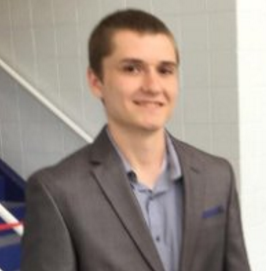

[Home](./index.md)/[Introduction](./introduction.md)/[Deliverables](./deliverables.md)/[Results](./results.md)/[About Us](./aboutus.md)/[Contact](contact.md)

### Michael McGrath

Mike McGrath will graduate from Bradley University in May 2017 with a degree in Electrical/Computer Engineering. His experience in the classroom and working in the field provide him the skills he needs to become a successful engineer upon graduation.

### Maisha Talukder

Maisha Talukder is a senior Electrical Engineering student at Bradley University with a minor in Management and Leadership. Maisha is expected to graduate with her Bachelor’s degree on May 2017.  Her past experience include interning for pharmaceutical company, Eli Lilly and Company, as an Electrical Engineer. After graduation, she will be joining as a full-time Automation Engineer at Lilly. Outside of work and school, Maisha enjoys spending time with her friends and family, cooking, and reading.

### William Kelly

William Kelly is currently working on his Bachelor’s in Electrical Engineering at Bradley University in Peoria, IL with a minor in Entrepreneurship and Innovation. His planned graduation date is May 2017. He has interned at a defense contractor, Northrop Grumman and an electrical construction company called Helix Electric. Upon graduation he plans on pursuing a career in Systems Engineering. 

