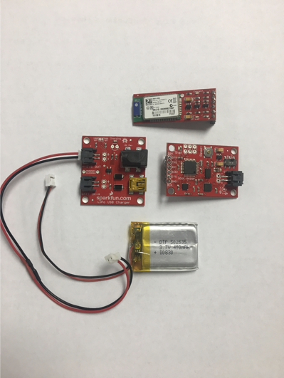

[Home](./index.md)/[Introduction](./introduction.md)/[Deliverables](./deliverables.md)/[Results](./results.md)/[About Us](./aboutus.md)/[Contact](contact.md)

## Introduction

### Description
The objective of this project is to create a wearable, user-friendly automatic fall detection and alert device. We are creating this device to give senior citizens peace of mind that help will arrive if they fall (even if they are unconscious). The self-activating fall alarm must be a wearable, wireless, device which collects acceleration and orientation data of the user to depicts if a fall has resulted. The device must autonomously send alerts to a series of caregivers when an incident has occurred. 

### Parts
We used the following parts for our system:

- 9DOF Razor IMU
- Bluetooth Mate Gold
- 400 mAh Lithium-Ion Battery
- JST Connector (Male-to-Male)

Picture of individual components of system.

Picture of Components inside prototype box.

### Fall-Detection Algorithm
In order to determine if a fall has occured, we needed to develop an algorithm to automatically detect falls based on IMU data. Based on research and testing, we determined that we can detect falls solely using acceleration data. By testing different scenarios such as sitting, standing, walking, lying down, etc. we were able to determine acceleration values that are present for normal every day actions. A fall, however, generates such high acceleration values that we can distinguish an actual fall apart from an every day motion. We created an algorithm based on a threshold value, and if magnitude of acceleration exceeds this threshold, we can determine a fall has occured.

### Fall-Response Algorithm
Using postfix, we are able to send email messages, which can then be converted to SMS through email-to-text services provided by phone carriers. Once the fall flag is high, we send an email addressed to a phone number connected to a carrier’s email, which automatically converts the message to SMS and sends to the recipient’s phone.

[Link to screen capture of device running (with Matlab Plots)](https://www.youtube.com/watch?v=yvb8EgXs7Rw)

